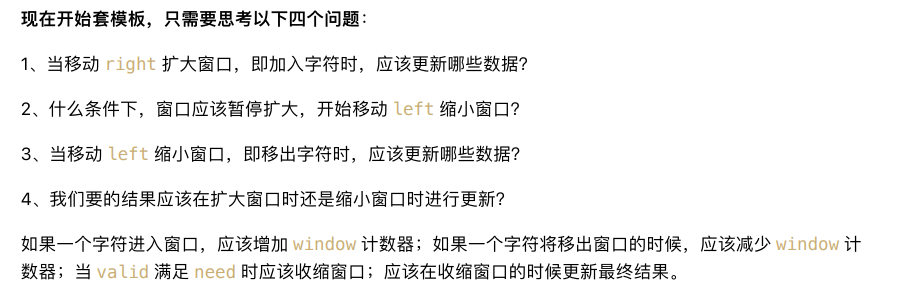
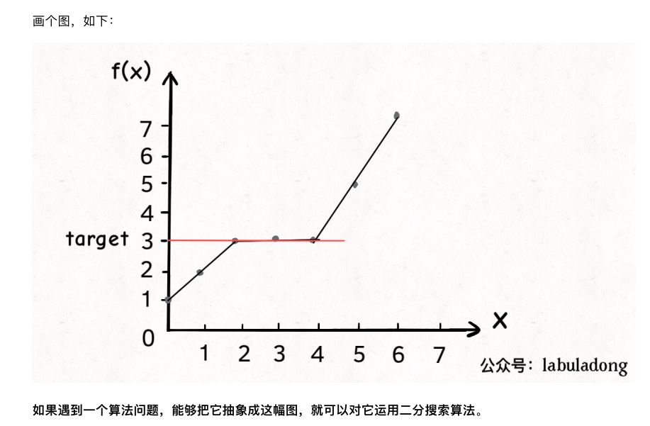
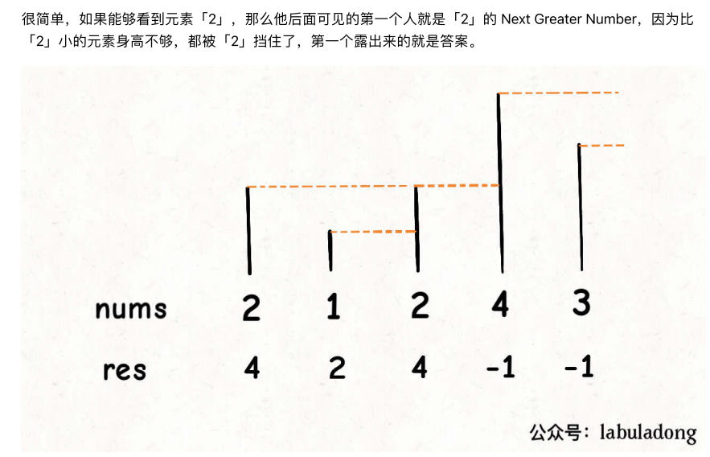

# 技巧汇总


## 前缀和

前缀和主要适⽤的场景是原始数组不会被修改的情况下，频繁查询某个区间的累加和。

leetcode题目数：303、304、560

```js
function subarraySum(nums: number[], k: number): number {
    let len = nums.length

    // 维护一个前缀和数组
    let preSum: number[] = new Array(len + 1);
    preSum[0] = 0
    for (let i = 1; i < len + 1; i++) {
        preSum[i] = preSum[i - 1] + nums[i - 1]
    }

    let res: number = 0

    // 穷举所有子数组
    for (let i = 1; i <= len; i++) {
        for (let j = 0; j < i; j++) {
            // ⼦数组 nums[j,i-1] 的元素和
            if (preSum[i] - preSum[j] == k)
                res++
        }
    }

    return res
};

// 优化的思路是：我直接记录下有⼏个preSum[j]和preSum[i] - k相等，
// 直接更新结果，就避免了内层 的for循环。
// 我们可以⽤哈希表，在记录前缀和的同时记录该前缀和出现的次数


function subarraySum01(nums: number[], k: number): number {
    let len = nums.length

    // map：前缀和 -> 该前缀和出 的次数
    let preSum: Map<number, number> = new Map();

    preSum.set(0, 1)

    let res = 0, sum0_i = 0
    for (let i = 0; i < len; i++) {
        sum0_i += nums[i]

        // 我们想找的前缀和 nums[0..j]
        let sum0_j = sum0_i - k

        // 如前⾯有目标前缀和，则直接更新答案
        if (preSum.has(sum0_j)) {
            res += preSum.get(sum0_j)
        }

        // 把前缀和nums[0..i]加入记录出现次数
        preSum.set(sum0_i, (preSum.get(sum0_i) ?? 0) + 1)
    }

    return res

};
```


## 差分数组

差分数组的主要适⽤场景是频繁对原始数组的 某个区间的元素进⾏增减。

leetcode题目：370、1109、1094

```js
class Difference {
    // 差分数组
    private diff: number[]

    constructor(nums: number[]) {
        let len = nums.length
        if (len === 0) {
            return
        }

        // 输入一个初始数组，区间操作将在这个数组上进行
        this.diff = new Array(len)

        // 据初始数组 差分数组
        this.diff[0] = nums[0]
        for (let i = 1; i < nums.length; i++) {
            this.diff[i] = nums[i] - nums[i - 1]
        }

    }

    // 给闭区间[i, j]增加val（可以是负数）
    public increment(i: number, j: number, val: number): void {
        this.diff[i] += val
        if (j + 1 < this.diff.length) {
            this.diff[j + 1] -= val
        }
    }

    // 返回结果数组
    // this.diff[i] = res[i] - res[i-1]
    public result(): number[] {
        // 根据diff数组计算返回nums数组
        let len = this.diff.length
        let res = new Array(len)
        res[0] = this.diff[0]

        for (let i = 1; i < len; i++) {
            res[i] = res[i - 1] + this.diff[i]
        }
        return res
    }
}
```


## 双指针

https://mp.weixin.qq.com/s/Nh6jxQtO-xOT_WuX-B5w3Q

我把双指针技巧再分为两类，一类是「快慢指针」，一类是「左右指针」。前者解决主要解决链表中的问题，比如典型的判定链表中是否包含环；后者主要解决数组（或者字符串）中的问题，比如二分查找。


### 快慢指针

**1、判定链表中是否含有环**

leetcode 141

```js
function hasCycle(head: ListNode | null): boolean {
    let slow = head;
    let fast = head;

    // 快指针走到末尾时候停止
    while (fast != null && fast.next != null) {
        slow = slow.next
        fast = fast.next.next

        if (slow == fast) {
            return true
        }
    }
    // 不包含环
    return false
}
```


**2、已知链表中含有环，返回这个环的起始位置**


```js
function detectCycle(head: ListNode | null): ListNode | null {
    let fast, slow;
    fast = slow = head

    while (fast != null && fast.next !== null) {
        fast = fast.next.next
        slow = slow.next

        if (fast == slow) {
            break
        }
    }

    if (fast == null || fast.next == null){
        return null
    }

    // 重新指向头结点
    slow = head

    // 快慢指针同步前进，相交点就是环的起点
    while (slow != fast) {
        fast = fast.next
        slow = slow.next
    }
    return slow
};
```


**3、寻找链表的中点**

leetcode876

```js
function middleNode(head: ListNode | null): ListNode | null {
    let slow = head, fast = head;

    while (fast !== null && fast.next !== null) {
        fast = fast.next?.next
        slow = slow.next
    }
    return slow
};
```


**4、寻找链表的倒数第`n`个元素**

leetcode19

```js

function removeNthFromEnd(head: ListNode | null, n: number): ListNode | null {
    let dummy = new ListNode(-1)
    dummy.next = head

    let cur = findFromEnd(dummy, n + 1)
    cur.next = cur.next.next


    return dummy.next
};


function findFromEnd(head: ListNode, k: number) {
    let p1 = head;
    let p2 = head;

    // p1先走k步
    for (let i = 0; i < k; i++) {
        p1 = p1?.next;
    }

    // p1 p2 同时走n-k步
    while (p1 != null) {
        p1 = p1?.next
        p2 = p2?.next
    }

    // p2指向第n-k个节点
    return p2
}
```


### 左右指针

leetcode题目：面试题01.05

左右指针在数组中实际是指两个索引值，一般初始化为`left = 0, right = nums.length - 1`。

**1、二分查找**

```js
function binarySearch(nums: number[], target: number) {
    let left = 0, right = nums.length - 1;

    while (left <= right) {
        let mid = left + Math.floor((right - left) / 2)
        if (nums[mid] == target) {
            return mid
        } else if (nums[mid] < target) {
            left = mid + 1
        } else if (nums[mid] > target) {
            right = mid - 1
        }
    }
    return -1
}
```

**2、两数之和**

leetcode167

```js
function twoSum(numbers: number[], target: number): number[] {
    let left = 0, right = numbers.length - 1
    while (left < right) {
        let sum = numbers[left] + numbers[right]
        if (sum == target) {
            return [left + 1, right + 1]
        } else if (sum > target) {
            // 让sum小一点
            right--
        } else {
            // 让sum大一点
            left++
        }
    }

    return []
};
```

**3、反转数组**

leetcode344

```js
/**
 Do not return anything, modify s in-place instead.
 */
function reverseString(s: string[]): void {
    let left = 0, right = s.length - 1

    while (left < right) {
        [s[left], s[right]] = [s[right], s[left]]
        left++
        right--
    }

};
```


**4、滑动窗口算法**

这也许是双指针技巧的最高境界了，如果掌握了此算法，可以解决一大类子字符串匹配的问题，不过「滑动窗口」稍微比上述的这些算法复杂些。

http://mp.weixin.qq.com/s?__biz=MzAxODQxMDM0Mw==&mid=2247485141&idx=1&sn=0e4583ad935e76e9a3f6793792e60734&chksm=9bd7f8ddaca071cbb7570b2433290e5e2628d20473022a5517271de6d6e50783961bebc3dd3b&scene=21#wechat_redirect


## 滑动窗口



leetcode题目序号：76、567、438、3、[713. 乘积小于 K 的子数组](https://leetcode-cn.com/problems/subarray-product-less-than-k/)

**代码模板**

```js
// let s: string[] = new Array()
// let left = 0, right = 0;

// while (right < s.length) {
//     // 增大窗口
//     window.add(s[right])
//     right ++;

//     while(window needs shrink){
//         // 缩小窗口
//         window.remove(s[left])
//         left++
//     }
// }


function slidingWindow(s: string, t: string) {
    let need = {}, window = {}

    for (let i = 0; i < t.length; i++) {
        let c = t[i]
        if (need.hasOwnProperty(c)) {
            need[c] += 1
        } else {
            need[c] = 0
        }

    }

    let left = 0, right = 0;
    let valid = 0;

    while (right < s.length) {
        // c是将要移入窗口的字符
        let c = s[right]

        // 右移窗口
        right++

        // 进行窗口内数据的一系列更新
        // ...

        // debug 输出的位置
        console.log("window: ", left, right)

        // 判断左窗口是否需要收缩
        // window needs shrink
        while (window needs shrink) {
            let d = s[left]

            // 左移窗口
            left++

            // 进行窗口内数据的一系列更新
        }
    }
}
```


## 二分法

leetcode题目序号：704、34、875、1011

二分查找基础全解：

https://leetcode.cn/problems/shortest-subarray-to-be-removed-to-make-array-sorted/solution/by-sui-xin-yuan-zhsd/
209. 长度最小的子数组	209. 二分查找区间和	前缀和 + 二分查找
611. 有效三角形的个数	611. 蓝红二分法分左右	排序 + 二分查找
658. 找到 K 个最接近的元素	658. 抽象的蓝红划分方案详解	二分查找
1894. 找到需要补充粉笔的学生编号	1894. 模拟到二分	前缀和 + 二分查找
300. 最长递增子序列	300. 根据处理策略决定蓝红划分方案	贪心 + 二分查找
1760. 袋子里最少数目的球	1760. 构造区间进行二分查找	二分查找
875. 爱吃香蕉的珂珂	875. 构造区间进行二分查找	二分查找
1552. 两球之间的磁力	1552. 构造区间进行二分查找	排序 + 二分查找
287. 寻找重复数	287. 元素范围映射下标范围常用解法	二分查找
1283. 使结果不超过阈值的最小除数	1283. 构造区间进行二分查找	二分查找
1898. 可移除字符的最大数目	1898. 蓝红二分法分左右	二分查找
1870. 准时到达的列车最小时速	1870. 构造区间进行二分查找	二分查找
1482. 制作 m 束花所需的最少天数	1482. 构造区间进行二分查找	二分查找
1818. 绝对差值和	1818. 明确查找目标转化为二分查找问题	排序 + 二分查找
240. 搜索二维矩阵 II	240. 逐步缩小二分查找区间	二分查找
275. H 指数 II	275. 蓝红二分法分左右	二分查找
1838. 最高频元素的频数	1838. 搜索区间常用解决方案	排序 + 前缀和 + 二分查找
540. 有序数组中的单一元素	540. 蓝红二分法分左右	二分查找
222. 完全二叉树的节点个数	222. 构造区间进行二分查找	位运算 + 二分查找
1712. 将数组分成三个子数组的方案数	1712. 多次利用二分查找加速线性查找	前缀和 + 二分查找
826. 安排工作以达到最大收益	826. 线性查找到二分查找	排序 + 二分查找
436. 寻找右区间	436. 蓝红二分法分左右	排序 + 二分查找
81. 搜索旋转排序数组 II	81. 二分查找预处理转化为经典二分查找题	二分查找
162. 寻找峰值	162. 深入理解二分查找	二分查找
154. 寻找旋转排序数组中的最小值 II	154. 蓝红二分法分左右	二分查找
528. 按权重随机选择	528. 构造区间进行二分查找	前缀和 + 二分查找
1574. 删除最短的子数组使剩余数组有序	1574. 全区间分三段后再搜索区间	双指针 + 二分查找
1508. 子数组和排序后的区间和	1508. 多次利用二分查找加速线性查找，官方题解优化	前缀和 + 二分查找
1292. 元素和小于等于阈值的正方形的最大边长	1292. 蓝红二分法分左右	前缀和 + 二分查找
1498. 满足条件的子序列数目	1498. 双指针 and 二分查找一题双解	排序 + 二分查找
981. 基于时间的键值存储	981. 蓝红二分法分左右	二分查找
1300. 转变数组后最接近目标值的数组和	1300. 多重二分查找 + 多维度二分查找，官方题解优化	排序 + 前缀和 + 二分查找
1802. 有界数组中指定下标处的最大值	1802. 构造区间进行二分查找	二分查找
1901. 找出顶峰元素 II	1901. 深入理解二分查找	二分查找
1146. 快照数组	1146. 模拟到二分	二分查找
1488. 避免洪水泛滥	1488. 雨天蓄水晴天放水最晚测涝最早防涝	贪心 + 二分查找
1562. 查找大小为 M 的最新分组	1562. 正向思维 vs 逆向思维	二分查找
1648. 销售价值减少的颜色球	1648. 多重二分查找 + 多维度二分查找	排序 + 前缀和 + 二分查找
1201. 丑数 III	1201. 蓝红二分法分左右	二分查找
911. 在线选举	911. 蓝红二分法分左右	二分查找




```js
function binarySearch(nums: number[], target: number) {
    let left = 0, right = nums.length - 1;

    while (left <= right) {
        let mid = left + Math.floor((right - left) / 2)
        if (nums[mid] == target) {
            return mid
        } else if (nums[mid] < target) {
            left = mid + 1
        } else if (nums[mid] > target) {
            right = mid - 1
        }
    }
    return -1
}

function leftBound(nums: number[], target: number) {
    if (nums.length == 0) return -1
    let left = 0, right = nums.length; // 注意

    while (left < right) {  // 注意
        let mid = left + Math.floor((right - left) / 2)
        if (nums[mid] == target) {
            right = mid
        } else if (nums[mid] < target) {
            left = mid + 1
        } else if (nums[mid] > target) {
            right = mid   // 注意
        }
    }
    return -1
}


function leftBound01(nums: number[], target: number) {
    if (nums.length == 0) return -1
    let left = 0, right = nums.length - 1

    // 搜索区间为[left, right]
    while (left <= right) {  // 注意
        let mid = left + Math.floor((right - left) / 2)
        if (nums[mid] < target) {
            // 搜索区间变为[mid +1 , right]
            left = mid + 1
        } else if (nums[mid] > target) {
            // 搜索区间变为[left , mid -1]
            right = mid - 1
        } else if (nums[mid] == target) {
            // 收缩右侧边界
            right = mid - 1
        }
    }

    // 检查出界情况
    if (left >= nums.length || nums[left] != target) {
        return -1
    }
    return left
}


function rightBound01(nums: number[], target: number) {
    if (nums.length == 0) return -1
    let left = 0, right = nums.length


    while (left < right) {
        let mid = left + Math.floor((right - left) / 2)
        if (nums[mid] == target) {
            left = mid + 1    // 注意
        } else if (nums[mid] < target) {
            left = mid + 1
        } else if (nums[mid] > target) {
            right = mid
        }
    }


    return right - 1 // 注意
}


function rightBound02(nums: number[], target: number) {
    if (nums.length == 0) return -1
    let left = 0, right = nums.length - 1

    // 搜索区间为[left, right]
    while (left <= right) {  // 注意
        let mid = left + Math.floor((right - left) / 2)
        if (nums[mid] < target) {
            // 搜索区间变为[mid +1 , right]
            left = mid + 1
        } else if (nums[mid] > target) {
            // 搜索区间变为[left , mid -1]
            right = mid - 1
        } else if (nums[mid] == target) {
            // 收缩左侧边界
            left = mid + 1
        }
    }

    // 检查出界情况 检查right越界的情况
    if (right < 0 || nums[right] != target) {
        return -1
    }
    return right
}


// 函数f是关于自变量x的单调函数
function f(x) {
    // 
    return x
}

// 主函数，在f(x) == target 的约束下，求x的最小值
function solution(nums: number[], target: number) {
    if (nums.length == 0) return -1

    // 问自己：自变量x的最小值是多少？
    let left = 0

    // 问自己 自变量x的最大值是多少？
    let right = nums.length + 1

    while (left < right) {
        let mid = left + Math.floor((right - left) / 2)
        if (f(mid) == target) {
            // 问自己： 题目是求左边界还是右边界？
            // ...
        } else if (f(mid) < target) {
            // 问自己：怎么让f(x)更大一点？
            // ...
        } else if (f(mid) > target) {
            // 问自己：怎么让f(x)更小一点？
            // ...
        }
    }

    return left
}
```


## 原地修改数组

常用：双指针中的左右指针。

把待删除元素交换到最后⼀个，然后 再删除，就可以避免数据搬移。

leetcode：26、83、27、283、380、710

代码模板：寻找倒数第k个元素

```js
function findFromEnd(head: ListNode, k: number) {
    let p1 = head;
    let p2 = head;

    // p1先走k步
    for (let i = 0; i < k; i++) {
        p1 = p1?.next;
    }

    // p1 p2 同时走n-k步
    while (p1 != null) {
        p1 = p1?.next
        p2 = p2?.next
    }

    // p2指向第n-k个节点
    return p2
}
```


## 链表操作

常用：双指针中的快慢指针、递归

**快慢指针**

21.合并两个有序链表（简单）
23.合并K个升序链表（困难）
141.环形链表（简单）
142.环形链表II（中等）
876.链表的中间结点（简单）
19.删除链表的倒数第N 个结点（中等） 160.相交链表（简单）

**递归**

206、翻转链表

92、翻转链表II

```js


// 翻转链表中的前n个
function listReverseN(head, n) {
    if (n <= 1) {
        return head
    }

    let successor = null // 后驱节点

    function reverseN(head, n) {


        if (n == 1) {
            // 记录第n+1个节点
            successor = head.next
            return head
        }


        // 以head.next为起点，需要反转前n-1个节点
        let last = reverseN(head.next, n - 1)


        head.next.next = head
        head.next = successor
        return last
    }

    return reverseN(head, n)
}


function reverseBetween(head: ListNode | null, left: number, right: number): ListNode | null {
    if (head == null || head.next == null || right == left) {
        return head
    }

    if (head.next.next == null) {
        let newHead = head.next
        newHead.next = head
        head.next = null
        return newHead
    }


    if (left == 1) {
        return listReverseN(head, right)
    }

    // 找到第left - 1 个节点
    let p1 = head

    for (let i = 1; i < left - 1; i++) {
        p1 = p1.next
    }

    let p2 = listReverseN(p1.next, right - left + 1)

    if (p1 !== p2) p1.next = p2

    return head

};

function reverseBetween01(head: ListNode | null, left: number, right: number): ListNode | null {
    if (head == null || head.next == null || right == left) {
        return head
    }

    if (left == 1) {
        return listReverseN(head, right)
    }

    // 前进到翻转的起点 base case
    head.next = reverseBetween(head.next, left - 1, right - 1)

    return head
};
```


## 蓄水池

```

```


## 单调栈

专门用来处理典型的`Next Greater Element`问题。

leetcode：496、503、739

**模板**



```ts
function nextGreaterElement(nums: number[]) {
    let n = nums.length
    let res = new Array(n)
    let stack = []

    // 倒着往里放入
    for (let i = n - 1; i >= 0; i--) {
        // 判定个子高矮
        while (stack.length > 0 && stack[stack.length - 1] <= nums[i]) {
            // 矮个子起开，反正也被挡着了
            stack.pop()
        }

        // nums[i]身后的 next greater number
        res[i] = stack.length == 0 ? -1 : stack[stack.length - 1]

        stack.push(nums[i])
    }
    return res
}
```


## 洗牌算法

```js
function shuffle(arr: number[] = []) {
    for (let j = arr.length - 1; j >= 0; j--) {
        const randomIndex = Math.floor(Math.random() * j + 1); 
        [arr[j], arr[randomIndex]] = [arr[randomIndex], arr[j]]
    }
    return arr;
}

console.log(shuffle([1, 2, 3, 4, 5]));
```


## 田忌赛马

```js
function advantageCount(nums1: number[], nums2: number[]): number[] {
    let n: number = nums1.length

    // maxpq是一个优先级队列，给sum2降序排序
    let maxpq = new PriorityQueue()

    for (let i = 0; i < n; i++) {
        // 后面入队
        maxpq.enqueue([i, nums2[i]], -nums2[i])
    }

    // 给sum1升序排序
    nums1 = nums1.sort((a, b) => {
        return a - b
    })

    let left = 0, right = n - 1
    let res = []

    while (!maxpq.isEmpty()) {
        // 前面出队
        let pair = maxpq.dequeue()

        // maxval是nums2中的最大值，i是对应的索引
        let [i, maxval] = pair

        if (maxval < nums1[right]) {
            // 如果nums1[right]能胜过maxval，那就自己上
            res[i] = nums1[right]
            right--
        } else {
            // 否则用最小值跟nums2浑水摸鱼
            res[i] = nums1[left]
            left++
        }
    }
    return res
};


function advantageCount01(nums1: number[], nums2: number[]): number[] {
    let n: number = nums1.length

    // maxpq是一个优先级队列，给sum2降序排序
    let maxpq: number[][] = []

    for (let i = 0; i < n; i++) {
        // 后面入队
        maxpq.push([i, nums2[i]])
    }

    maxpq = maxpq.sort((pair1, pair2) => {
        return pair2[1] - pair1[1]
    })

    // 给sum1升序排序
    nums1 = nums1.sort((a, b) => {
        return a - b
    })

    let left = 0, right = n - 1
    let res = []

    while (maxpq.length > 0) {
        // 前面出队
        let pair = maxpq.shift()

        // maxval是nums2中的最大值，i是对应的索引
        let [i, maxval] = pair

        if (maxval < nums1[right]) {
            // 如果nums1[right]能胜过maxval，那就自己上
            res[i] = nums1[right]
            right--
        } else {
            // 否则用最小值跟nums2浑水摸鱼
            res[i] = nums1[left]
            left++
        }
    }

    return res
};


function advantageCount02(nums1: number[], nums2: number[]): number[] {
    // 升序
    nums1 = nums1.sort((a, b) => a - b);

    // 小顶堆
    const maxpq = nums2.map((item, index) => [index, item]).sort((a, b) => a[1] - b[1])

    let result = [];
    let left = 0, right = nums1.length - 1;
    for (let i = maxpq.length - 1; i >= 0; i--) {
        // 
        const cur2 = maxpq[i];
        const cur1 = nums1[right];
        if (cur1 > cur2[1]) {
            result[cur2[0]] = cur1;
            right--;
        } else {
            result[cur2[0]] = nums1[left];
            left++;
        }
    }
    return result;
};
```


## 动态规划


## BFS

breadth-first-search

126 127


## DFS


## Dijkstra

743、1514、1631

Dijkstra 算法（一般音译成迪杰斯特拉算法）相当于一个 BFS 算法的加强版，它们都是从二叉树的层序遍历衍生出来的。

```

```


## 并查集（UNION-FIND）

leetcode:323、130、 990

```typescript
class UF {
    // 记录连通分量
    count;

    // 节点 x 的根节点是 parent[x]
    parent;

    // 记录树的“重量”
    size;

    constructor(n) {

        // 一开始互不连通
        this.count = n;

        // 父节点指针初始指向自己
        this.parent = new Array(n);

        this.size = new Array(n);

        for (let i = 0; i < n; i++) {
            this.parent[i] = i;
            this.size[i] = 1;
        }
    }

    /* 返回某个节点 x 的根节点 */
    find(x) {
        // 根节点的 parent[x] == x
        while (this.parent[x] !== x) {
            // 进行路径压缩
            this.parent[x] = this.parent[this.parent[x]];
            x = this.parent[x];
        }
        return x;
    }

    /* 将 p 和 q 连接 */
    union(p, q) {
        // 如果某两个节点被连通，则让其中的（任意）
        // 一个节点的根节点接到另一个节点的根节点上
        let rootP = this.find(p);
        let rootQ = this.find(q);
        if (rootP === rootQ) return;

        // 小树接到大树下面，较平衡
        if (this.size[rootP] > this.size[rootQ]) {
            this.parent[rootQ] = rootP;
            this.size[rootP] += this.size[rootQ];
        } else {
            this.parent[rootP] = rootQ;
            this.size[rootQ] += this.size[rootP];
        }

        this.count--; // 两个分量合二为一
    }

    /* 判断 p 和 q 是否连通 */
    connected(p, q) {
        let rootP = this.find(p);
        let rootQ = this.find(q);
        return rootP === rootQ;
    };

    /* 返回图中有多少个连通分量 */
    getCount() {
        return this.count;
    };
}

```


## 动态规划

### 动态规划：博弈


### 动态规划：最长递增子序列

https://labuladong.github.io/algo/3/24/77/


# 数据结构专题


## 队列(queue)

队列主要用在BFS算法

**leetcode**

232


## 栈(stack)

栈主要用在括号、波兰表达式等问题上

**leetcode**

252
20.有效的括号（简单）
921.使括号有效的最⼩添加（中等） 

1541.平衡括号串的最少插⼊（中等）


## 树(tree)


### 二叉搜索树

leetcode: 449

```js
/**
 * Definition for a binary tree node.
 * function TreeNode(val) {
 *     this.val = val;
 *     this.left = this.right = null;
 * }
 */

/**
 * Encodes a tree to a single string.
 *
 * @param {TreeNode} root
 * @return {string}
 */
 var serialize = function(root) {
    const ans = new Array()
    const dfs = function(node) {
        if(node != null) {
            dfs(node.left)
            dfs(node.right)
            ans.push(node.val)
        }
    }
    dfs(root)
    return ans.join(",")
};

/**
 * Decodes your encoded data to tree.
 *
 * @param {string} data
 * @return {TreeNode}
 */
var deserialize = function(data) {
    if(data == "") {
        return null
    }
    const vals = data.split(",").map(i => parseInt(i))
    const dfs = function(left, right) {
        const len = vals.length
        if(len == 0 || vals[len - 1] < left || vals[len - 1] > right)
            return null
        const val = vals.pop()
        const node = new TreeNode(val)
        node.right = dfs(val, right)
        node.left = dfs(left, val)
        return node
    }
    return dfs(-1, 10007)
};

/**
 * Your functions will be called as such:
 * deserialize(serialize(root));
 */
 
```


## 图(graph)

https://labuladong.github.io/algo/2/20/48/

图的遍历框架

```java
// 记录被遍历过的节点
boolean[] visited;
// 记录从起点到当前节点的路径
boolean[] onPath;

/* 图遍历框架 */
void traverse(Graph graph, int s) {
    if (visited[s]) return;
    // 经过节点 s，标记为已遍历
    visited[s] = true;
    // 做选择：标记节点 s 在路径上
    onPath[s] = true;
    for (int neighbor : graph.neighbors(s)) {
        traverse(graph, neighbor);
    }
    // 撤销选择：节点 s 离开路径
    onPath[s] = false;
}
```


很多题目需要手动构建图

```js

// 建图函数
function buildGraph(n: number, prerequisites: number[][]): number[][] {
    // 图节点编号为 1...n
    let graph = new Array(n + 1).fill(0);

    for (let i = 0; i <= n; i++) {
        graph[i] = [];
    }

    prerequisites.forEach(edge => {
        let from = edge[1];
        let to = edge[0];

        // 「无向图」相当于「双向图」
        // v -> w
        // graph[v].push(w);
        // // w -> v
        // graph[w].push(v);

        // 修完课程 from 才能修课程 to
        // 在图中添加一条从 from 指向 to 的有向边
        graph[from].push(to)
    })

    // console.log(graph);
    return graph
}
```

leetcode: 797、785、207、210


### 判断二分图

```js
// 主函数，输入邻接表，判断是否是二分图
// 用两种颜色将图中的所有顶点着色，
// 且使得任意一条边的两个端点的颜色都不相同
function isBipartite(graph: number[][]): boolean {
    let n = graph.length
    // 记录图是否符合二分图性质
    let ok: boolean = true;
    // 记录图中节点的颜色，false 和 true 代表两种不同颜色
    let color: boolean[] = new Array(n).fill(false)
    // 记录图中节点是否被访问过
    let visited: boolean[] = new Array(n).fill(false)

    // DFS 遍历框架
    function traverse(graph: number[][], v: number): void {
        // 如果已经确定不是二分图了，就不用浪费时间再递归遍历了
        if (!ok) return

        visited[v] = true

        graph[v].forEach(w => {
            if (!visited[w]) {
                // 相邻节点 w 没有被访问过
                // 那么应该给节点 w 涂上和节点 v 不同的颜色
                color[w] = !color[v];
                // 继续遍历 w
                traverse(graph, w);
            } else {
                // 相邻节点 w 已经被访问过
                // 根据 v 和 w 的颜色判断是否是二分图
                if (color[w] == color[v]) {
                    // 若相同，则此图不是二分图
                    ok = false;
                }
            }
        })
    }

    // 因为图不一定是联通的，可能存在多个子图
    // 所以要把每个节点都作为起点进行一次遍历
    // 如果发现任何一个子图不是二分图，整幅图都不算二分图
    for (let v = 0; v < n; v++) {
        if (!visited[v]) {
            traverse(graph, v);
        }
    }
    return ok;
};
```


### 判断图中是否有环

```
function canFinish(numCourses: number, prerequisites: number[][]): boolean {

    // 记录一次 traverse 递归经过的节点
    const onPath: boolean[] = new Array(numCourses).fill(false)

    // 记录遍历过的节点，防止走回头路
    const visited: boolean[] = new Array(numCourses).fill(false)

    // 记录图中是否有环
    let hasCycle: boolean = false

    // 构建图
    const graph = buildGraph(numCourses, prerequisites)

    // DFS 遍历框架
    function traverse(graph: number[][], v: number): void {
        // 出现环
        if (onPath[v]) {
            hasCycle = true
        }

        if (visited[v] || hasCycle) {
            // 如果已经找到了环，也不用再遍历了
            return;
        }

        // 前序遍历代码位置
        visited[v] = true
        onPath[v] = true;

        graph[v].forEach(w => {
            traverse(graph, w);
        })

        // 后序遍历代码位置
        onPath[v] = false;
    }

    // 遍历图中的所有节点
    for (let i = 0; i < numCourses; i++) {
        traverse(graph, i);
    }

    // 只要没有循环依赖可以完成所有课程
    return !hasCycle;
};


// 建图函数
function buildGraph(n: number, prerequisites: number[][]): number[][] {
    // 图节点编号为 1...n
    let graph = new Array(n + 1).fill(0);

    for (let i = 0; i <= n; i++) {
        graph[i] = [];
    }

    prerequisites.forEach(edge => {
        let from = edge[1];
        let to = edge[0];

        // 「无向图」相当于「双向图」
        // v -> w
        // graph[v].push(w);
        // // w -> v
        // graph[w].push(v);

        // 修完课程 from 才能修课程 to
        // 在图中添加一条从 from 指向 to 的有向边
        graph[from].push(to)
    })

    // console.log(graph);
    return graph
}

```

